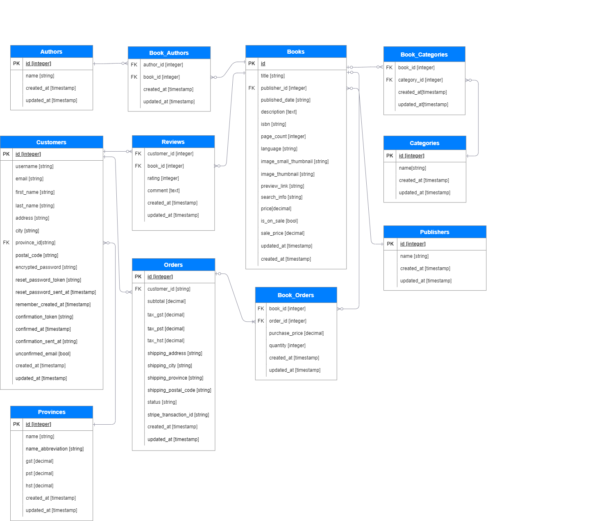
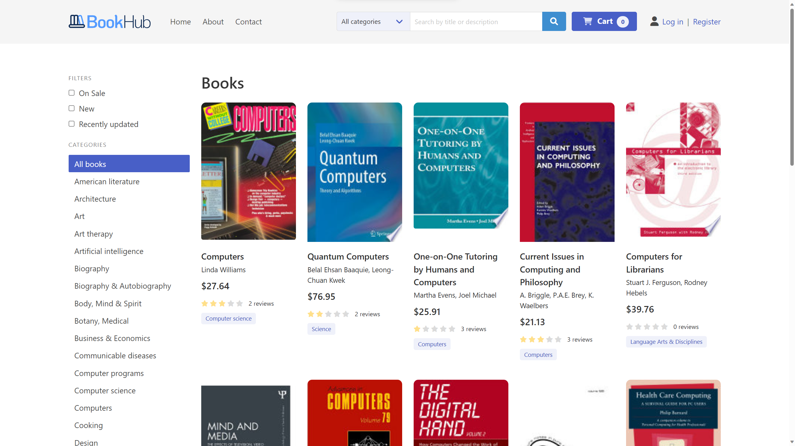
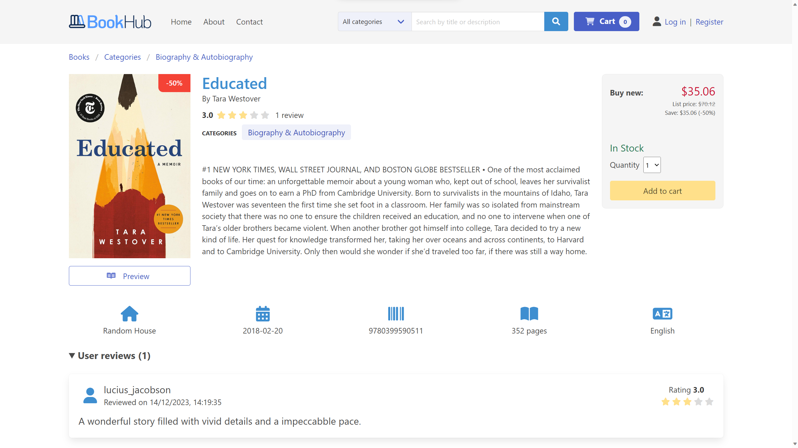
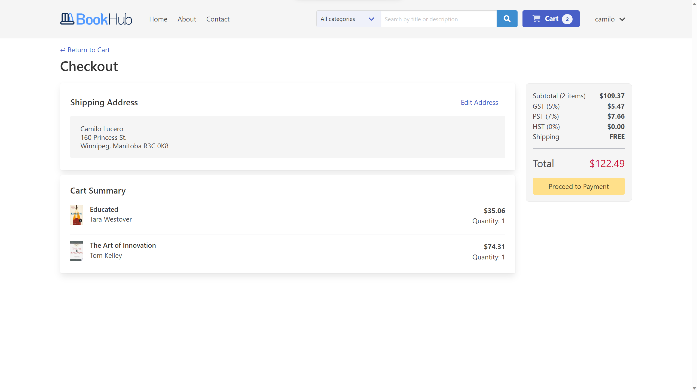

# BookHub E-Commerce Platform


BookHub is a user-friendly e-commerce web platform developed with Ruby on Rails, originally conceptualized as a college project. This platform allows book enthusiasts to explore a vast collection of books, view detailed information about each book, and seamlessly add their favourites to a shopping cart for purchase.

## Key Features:

- **User Authentication:** Users can create and manage an account to keep track of their orders.
- **Google Books API Integration:** Utilizes the Google Books API to populate the platform's database with a vast collection of books, ensuring an extensive and up-to-date library for users to explore.
- **Browsing Books:** Users can effortlessly browse, search, and filter through a wide selection of books and categories available on the platform.
- **Shopping Cart:** Easy management of selected books in a user's shopping cart for convenient checkout.
- **Secure Payments:** Integration with Stripe for secure and reliable payment processing.
- **Administrative Platform:** An interface for administrative users to manage settings, control data, and oversee the platform's functionality.

## Database Entity-Relationship Diagram (ERD)



Here is the visual representation of the database structure in BookHub. This diagram illustrates the relationships between various entities and their attributes within the database.

## Installation

To get started with BookHub, follow these simple steps:

1. Clone the repository:

   ```bash
   git clone https://github.com/milolucero/rails_library.git
   cd rails_library
   ```

2. Install dependencies using Bundler:

   ```bash
   bundle install
   ```

3. Perform database migration:

   ```bash
   rails db:migrate
   ```

4. Seed the database with initial data:

   ```bash
   rails db:seed
   ```

5. Option 1 - Start the Rails server (basic functionality, no Stripe checkout):

   ```bash
   rails server
   ```

6. Option 2 - Start the Rails server with Stripe checkout enabled for a test environment:

   ```bash
   PUBLISHABLE_KEY=your_stripe_public_key SECRET_KEY=your_stripe_secret_key rails server
   ```

Once the server is up and running, you can access BookHub by visiting [http://localhost:3000](http://localhost:3000) in your web browser.

## Additional notes

**To access the administrative platform**

1. Log in as an administrative user
   - Username: `admin@bookhub.com`
   - Password: `password`
2. Visit [http://localhost:3000/admin](http://localhost:3000/admin).

**To complete a purchase**

1. Run the platform running with Stripe checkout enabled.
2. When entering payment details use:
   - **Credit card number:** `4242 4242 4242 4242`
   - **Expiration date:** Any future date, such as `12/34`
   - **CVV number:** Any 3-digit number
   - Use any value you like for other form fields

## Preview

### Home Page



### Book details



### Checkout


